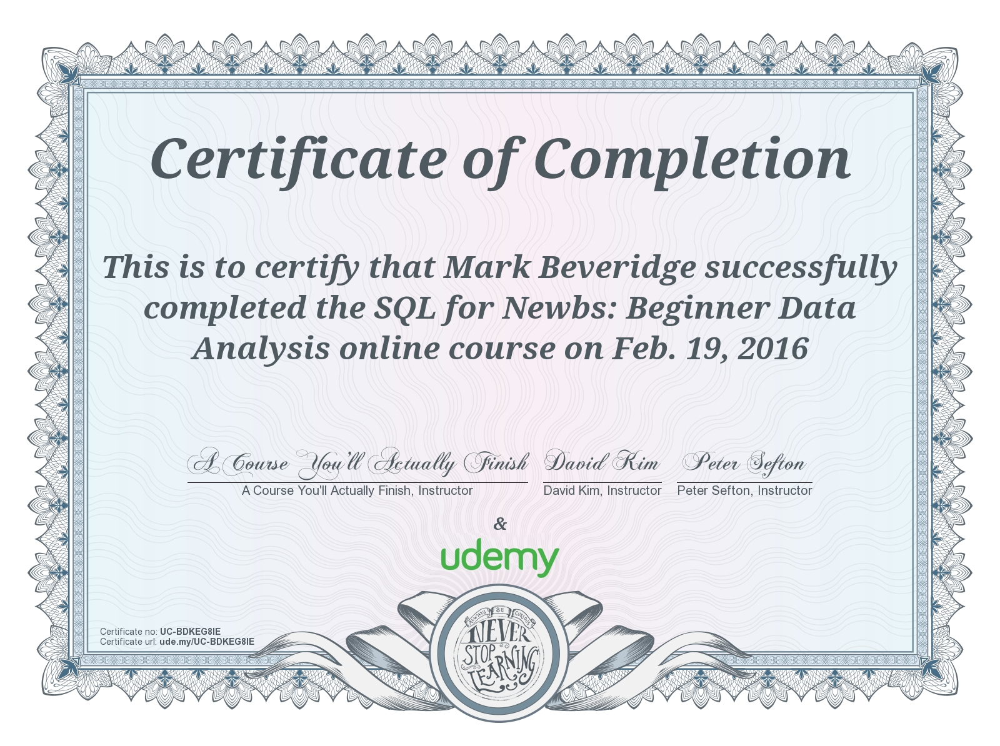

# Udemy : "[SQL for Newbs : Data Analysis for Beginners](https://www.udemy.com/sql-for-newbs/learn/v4/overview)"
###### Completed course : 19/2/16

_"teaches you real-world SQL - not just the theory in abstract, but real skills you can use to get more data-driven"_

## Syllabus
### Section 1 : Welcome!

### Section 2 : Intro to MySQL

### Section 3 : Basic Queries

### Section 4 : Advanced Querying

### Section 5 : BONUS Lectures

